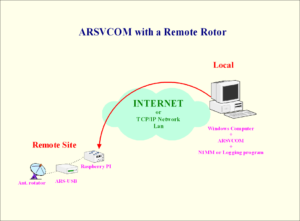
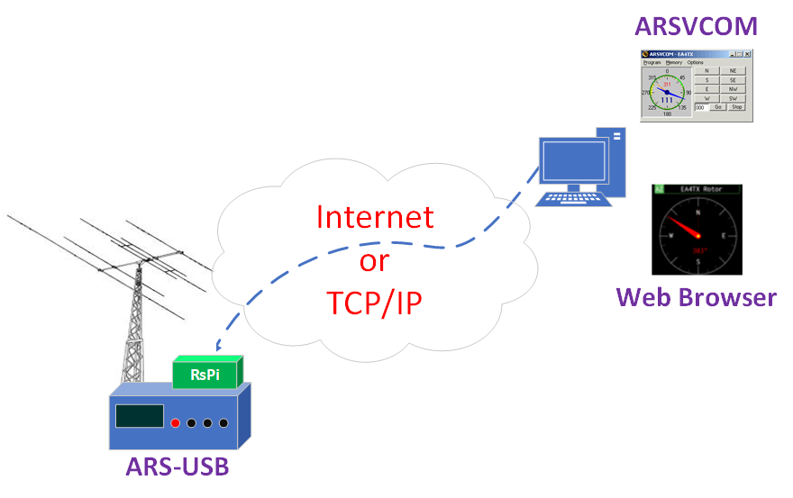

ARS-USB y el Control remoto
============================

Una excelente opción para el control remoto del motor por medio del ARS-USB, sin necesidad de tener que dejar un ordenador de sobremesa las 24h encendidas, es por medio de una Raspberry Pi o Rock3.

Te sugiero que visites este enlace donde se explica la puesta en marcha en detalle
    `https://ea4tx.com/faqs/remote-antenna-control <https://ea4tx.com/faqs/remote-antenna-control/>`_

    Ejemplo

    Ejemplo

.. figure:: ..\..\images\arsvcom.png
    :align: center
    :width: 50%

    Ejemplo