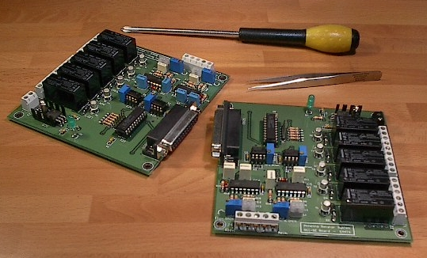

RCI - Second Edition
================

.. rcise:: 
   :sorted:

Segunda edición de la popular RCI que tanto éxito estaba teniendo. Se integra en un único PCB tanto el sistema de control de Acimut como de Elevación, mejorando la calidad de diseño y el ajuste o calibración.

Este modelo estuvo operativo 10 años.

.. image:: ../rcise.png
    :width: 35%
 